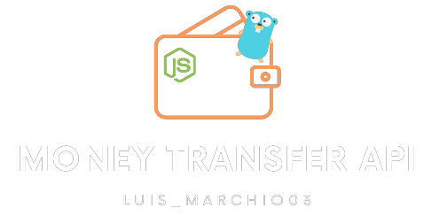

 

This is a project for a money transfer API built using Golang and Nodejs + Servelles framework + AWS Lambda. The API allows for transferring money between accounts and also includes the ability to cancel transfers. It also uses RabbitMQ for message queuing.


## Author

This project was authored by LuisMarchio03. Their Github profile can be found at https://github.com/LuisMarchio03/.


## Features

The following functionality has been implemented:

**[X] TransferService -> consumer rabbitMQ**

**[X] TransferService -> cancelamento de transferências**

**[X] TransferService -> cancelamento usecase**

**[X] TransferService -> handlers**

**[] TransferService -> remove mockUser**

**[] TransferService -> Find User**

**[] TransferService / WalletService -> Criar um User ID Compartilhado**

**[] TransferService -> producer update user to WalletService**

**[] WalletService -> consumer rabbitMQ**

**[] SendMessageService -> Create service to send message**

**[] All -> Variables to .env**

## Installation

Clone the repository:

```bash
git clone https://github.com/LuisMarchio03/MoneyTransferApi.git
```

Navigate to the project directory:

```bash
cd MoneyTransferApi
```

Install the dependencies:

```bash
cd transferService
go  mod tidy

cd walletService
npm install

cd gateway
npm install
```

Run the project:

```bash
cd gateway
npm run dev
```


The server will be running at http://localhost:8080.

## Usage

The following endpoints are available:

- `POST /transfer: transfer money from one account to another. Requires 

- `from_account_id, to_account_id, and amount in the request body.

- `POST /transfer/cancel: cancel a transfer. Requires transfer_id in the request body.

## License

This project is licensed under the MIT License - see the [LICENSE](https://choosealicense.com/licenses/mit/) file for details.


